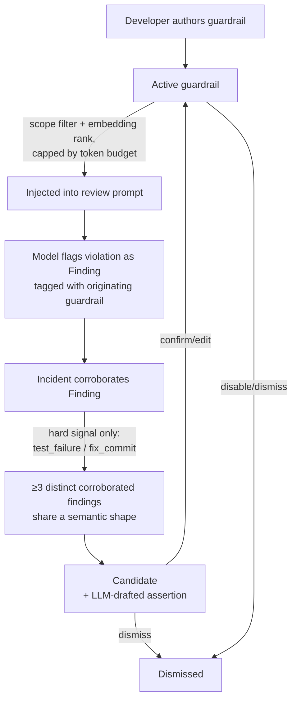

# feat: Pattern promotion → project guardrails

> **Status: Implemented (2026-06-13).** All 8 units shipped as a linear
> stacked-PR chain off master: Phase 1 — U1 #37, U2 #38, U3 #39, U4 #40, U5 #41;
> Phase 2 — U6 #42, U7 #43, U8 #44. TDD per unit; suite 699→803 passed / 16 skip.
> Two transparent deferrals (flagged in the PR bodies): the live *dashboard*
> pending-candidate view (skipped to honor KTD4 — clustering is on-demand only),
> and U8's gate is implemented as a *global* self-caused-soft exclusion rather
> than *scoped-to-originating-guardrail* (the stricter, safe direction; satisfies
> every plan scenario). Pending merge bottom-up #37→#44.

## Summary

Add a **guardrail** layer to Ollama Sentinel — named, curated rules injected into
reviews as LLM-checked, relevance-ranked checks. Guardrails are born two ways:
the developer **authors one directly** (Phase 1, the value-on-day-one path), or
the system **promotes a candidate** from ≥3 distinct corroborated findings sharing
a semantic shape, which the developer confirms (Phase 2, the compounding layer).
This implements the Finding→Incident→**Pattern** rung from `docs/VISION.md`.

The plan is phased: **Phase 1 (U1–U5)** ships the full value loop with zero
incident history; **Phase 2 (U6–U8)** layers auto-promotion and the
evidence-integrity gate on top of Phase 1's guardrail artifact and injection path.

---

## Problem Frame

The sentinel's memory stops at Findings (model opinions) and Incidents (objective
corroboration). Nothing turns recurring confirmed failures into a durable,
forward-looking rule that shapes future reviews. The north star
(`docs/VISION.md`): every future diff is reviewed with the codebase's failure
history as context. Pure auto-promotion stalls because corroborated incidents
accrue slowly — so manual authoring is first-class, and auto-promotion compounds
on top once volume exists (see origin: the manual-first decision).

---

## Requirements Traceability

Origin requirements (`docs/brainstorms/2026-06-08-pattern-promotion-guardrails-requirements.md`):

| R-ID | Requirement | Unit(s) |
|------|-------------|---------|
| R1 | Guardrail = named rule + NL assertion + optional scope | U1 |
| R2 | Manual authoring (primary) | U2 |
| R3 | Auto-promotion candidate from ≥3 distinct corroborated findings | U6, U7 |
| R4 | Curation: confirm/edit/disable/dismiss; nothing enforces unconfirmed | U2, U7 |
| R5 | Enforcement via injection into review prompt | U3 |
| R6 | Relevance-scoped injection (rank + token budget) | U3 |
| R7 | Provenance: finding records originating guardrail | U1, U4 |
| R8 | Evidence integrity: self-caused reinforce only via hard signal | U8 |
| R9 | Surfacing via CLI + dashboard | U2, U5, U7 |
| R10 | Lifecycle: disable/dismiss; disabled not injected | U2, U3 |

---

## Key Technical Decisions

- **KTD1 — Guardrail is a curated artifact + LLM matcher, no deterministic engine.**
  Enforcement is the review model evaluating the NL assertion against code, not a
  regex/AST pass (see origin KTD). Keeps the matcher flexible and avoids a new
  parsing engine.
- **KTD2 — Reuse the existing context-assembly injection path.**
  Guardrails inject through `build_review_context` as a new, higher-priority
  section alongside `PRIOR UNRESOLVED ISSUES` — same `Section`/`Priority`/retriever/
  `soft_budget` mechanism, no new prompt plumbing.
- **KTD3 — Reuse `SemanticRetriever`/`OllamaEmbedder` for both clustering and
  injection relevance.** Shape clustering (Phase 2) and injection ranking (Phase 1)
  both run on the existing `qwen3-embedding:4b` hot-path embedder; no new embedding
  dependency.
- **KTD4 — Auto-promotion clustering runs on-demand**, when the developer lists
  candidates — not on every incident persist or watcher tick. Keeps clustering
  cost off the review hot path. (Resolves origin open question "clustering cadence".)
- **KTD5 — Auto-promoted candidates arrive with an LLM-drafted assertion the
  developer edits at confirmation**, not a blank field. (Resolves origin open
  question "candidate assertion authoring".)
- **KTD6 — Injection relevance = declared scope filter, then embedding rank within
  budget.** A guardrail's `scope` (category and/or path glob) filters candidates
  for a given file/diff; the retriever then ranks the survivors by assertion-embedding
  similarity, capped by `soft_budget`. (Resolves origin open question "relevance signal".)
- **KTD7 — Promotion threshold = ≥3 *distinct* findings, each with ≥1 incident;
  self-caused findings reinforce only via `test_failure`/`fix_commit`.** Provenance
  (U1/U4) is what makes the integrity gate enforceable. (See origin KTDs.)

---

## High-Level Technical Design

Guardrail lifecycle and the reinforcing loop (authoritative shape):

Two creation paths converge on one **Active guardrail** artifact. Active guardrails
are scope-filtered and embedding-ranked into the review prompt. Flagged findings
carry provenance; only hard-corroborated self-caused findings feed back into
clustering (the integrity gate that prevents the Pattern-tier echo).

---

## Implementation Units

### U1. Guardrail storage model + finding provenance

**Goal:** Persist guardrails and let a finding record the guardrail that produced it.
**Requirements:** R1, R7.
**Dependencies:** none.
**Files:** `ollama_sentinel/violation_db.py`, `tests/test_violation_db.py`.
**Approach:** Add a `guardrails` table (name, NL assertion, scope fields for
category and path glob, status active/disabled/dismissed, source manual/promoted,
timestamps) with CRUD methods mirroring the existing finding persistence style.
Add a nullable provenance column to `findings` linking the originating guardrail,
applied via the existing idempotent `_migrate`-style additive migration (same
pattern as `triggering_commit_sha`/`resolution`). Exact column names and method
signatures are implementation-time.
**Patterns to follow:** existing `findings`/`incidents` table creation, the
idempotent additive-migration helper, and the upsert/CRUD style in `violation_db.py`.
**Test scenarios:**
- Creating a guardrail persists all fields and returns an id; round-trips via a get.
- Status transitions (active→disabled→active, active→dismissed) persist.
- Additive migration adds the provenance column to a pre-existing DB with no data loss (open an old-schema DB, confirm upgrade + existing rows intact).
- A finding can be written with and without a guardrail provenance reference; null is the default.
**Verification:** New guardrail CRUD + the provenance column exist; migration is idempotent on a populated DB; `pytest tests/test_violation_db.py` green.

### U2. Guardrail authoring + lifecycle CLI verbs

**Goal:** Author and curate guardrails from the CLI.
**Requirements:** R2, R4, R9, R10.
**Dependencies:** U1.
**Files:** `ollama_sentinel/cli.py`, `tests/test_cli.py`.
**Approach:** Add verbs to create a guardrail (name, assertion, optional
category/path scope), list guardrails, edit (name/assertion/scope), and
disable/dismiss — mirroring the `resolve`/`dismiss` family and their shared
close-helper. Nothing about authoring enforces until the guardrail is active;
disabled/dismissed guardrails are excluded from listing-as-active. Verb naming
(flat verbs vs a `guardrail` sub-group) is implementation-time; follow the
existing flat-verb convention unless a sub-group reads better.
**Patterns to follow:** `cli.resolve`/`cli.dismiss` + `_close_finding`,
`cli.findings` (list with filters), the config-load-or-exit helper.
**Test scenarios:**
- Create then list shows the guardrail as active with its assertion + scope.
- Edit changes the assertion/scope; list reflects it.
- Disable removes it from the active list; re-enable restores it.
- Dismiss is terminal and idempotent (dismiss twice → no error, stays dismissed).
- Creating with no scope is allowed (applies broadly); creating with a category and/or path scope persists both.
**Verification:** A developer can author, list, edit, disable, dismiss with no incident history; `pytest tests/test_cli.py` green.

### U3. Relevance-scoped injection into review context

**Goal:** Inject active, relevant guardrails into the review prompt within budget.
**Requirements:** R5, R6, R10.
**Dependencies:** U1.
**Files:** `ollama_sentinel/context/recipes.py`, `ollama_sentinel/processor.py`, `tests/context/test_recipes.py`.
**Approach:** Extend `build_review_context` with a guardrails input and a new
section ("PROJECT GUARDRAILS — check explicitly") at a priority above
`PRIOR UNRESOLVED ISSUES`, carrying its own `soft_budget` and the existing
`retriever` for embedding-rank. Before ranking, filter active guardrails by
declared scope (category match and/or path-glob match against the file under
review). `FileProcessor` loads active guardrails from the DB and passes them in.
Disabled/dismissed guardrails are never passed. Section wording is directional;
exact budget split is implementation-time.
**Patterns to follow:** the existing `prior_violations` → `PRIOR UNRESOLVED ISSUES`
section in `recipes.py` (Section/Priority/retriever/soft_budget), and how
`FileProcessor` already fetches ranked prior violations.
**Test scenarios:**
- With one active in-scope guardrail, the assembled prompt contains the guardrails section with the assertion text.
- A guardrail whose scope (category/path) doesn't match the file is excluded.
- Disabled/dismissed guardrails never appear in the prompt.
- When many guardrails exceed the section budget, the retriever ranks by relevance and the section respects `soft_budget` (assert the budget cap holds, mirroring the prior-violations budgeting test).
- Zero active guardrails → no guardrails section emitted (no empty header).
**Verification:** Active, in-scope guardrails appear ranked-and-capped in the review prompt; out-of-scope/disabled excluded; `pytest tests/context/test_recipes.py` green.

### U4. Provenance capture on guardrail-flagged findings

**Goal:** Record which guardrail caused a finding when one is flagged under an active guardrail.
**Requirements:** R7.
**Dependencies:** U1, U3.
**Files:** `ollama_sentinel/processor.py`, `ollama_sentinel/watcher.py`, `tests/test_processor.py`.
**Approach:** When findings are extracted from a review that injected guardrails,
associate a finding with the guardrail it corresponds to (best-effort match by
category/assertion correspondence — exact attribution heuristic is
implementation-time) and persist the provenance reference added in U1. Provenance
is best-effort and must never block finding persistence (consistent with the
existing best-effort extraction convention).
**Execution note:** Best-effort — a missed or absent provenance link degrades to
null, never raises.
**Patterns to follow:** the best-effort `extract_findings` → `persist_findings`
path; the "never block review saving" convention.
**Test scenarios:**
- A finding flagged while a single guardrail was injected records that guardrail's provenance.
- A finding unrelated to any injected guardrail records null provenance.
- Provenance attribution failure (ambiguous/none) degrades to null without raising.
**Verification:** Guardrail-attributable findings carry provenance; failures degrade silently; `pytest tests/test_processor.py` green.

### U5. Dashboard guardrails panel

**Goal:** Make active guardrails (and, post-Phase-2, candidates) visible in the TUI.
**Requirements:** R9.
**Dependencies:** U1.
**Files:** `ollama_sentinel/dashboard.py`, `tests/test_dashboard.py`.
**Approach:** Add a read-only panel listing active guardrails (name, scope,
source). Follow the existing panel pattern (polls the DB read-only, degrades
independently). Candidate display is wired in U7; this unit lands the active-
guardrails panel.
**Patterns to follow:** existing dashboard panels (`_patterns_panel` /
recurring-violations panel), the per-source independent-degradation loop.
**Test scenarios:**
- Panel renders active guardrails with name + scope.
- Empty state (no guardrails) renders without error.
- DB read failure degrades the panel independently without crashing the dashboard.
**Verification:** Dashboard shows an active-guardrails panel that degrades safely; `pytest tests/test_dashboard.py` green.

### U6. Shape clustering + candidate detection

**Goal:** Detect candidate guardrails from ≥3 distinct corroborated findings sharing a semantic shape.
**Requirements:** R3.
**Dependencies:** U1.
**Files:** `ollama_sentinel/violation_db.py` (read-side selectors), a new
`ollama_sentinel/guardrails.py` (clustering logic), `tests/test_guardrails.py`.
**Approach:** Select findings that have ≥1 incident (corroborated), group by
category, and cluster within category by embedding similarity (reusing the
semantic retriever/embedder). A shape with ≥3 *distinct* corroborated findings is
a candidate. Pure clustering logic lives in a leaf module so it's testable without
the watcher; the DB read selectors are read-only. Runs on-demand (KTD4), not on
the hot path. Similarity threshold and cluster representation are implementation-time.
**Execution note:** Implement the clustering/threshold logic test-first against
synthetic findings with controlled embeddings (mirror the `_FakeEmbedder` pattern
used in the recipes/retriever tests).
**Test scenarios:**
- Three distinct corroborated findings with near-identical embeddings + same category → one candidate.
- Three findings in a cluster but only two corroborated → no candidate (threshold counts corroborated distinct findings).
- One finding corroborated by three incidents → no candidate (distinct findings, not incident count — guards the threshold semantics).
- Findings in the same category but embedding-dissimilar → no candidate.
- Cross-category similar findings → not merged into one candidate.
**Verification:** Candidate detection fires only on ≥3 distinct corroborated same-shape findings; `pytest tests/test_guardrails.py` green.

### U7. Candidate surfacing + curation

**Goal:** Surface candidates with an LLM-drafted assertion; confirm into an active guardrail or dismiss.
**Requirements:** R3, R4, R9.
**Dependencies:** U2, U6.
**Files:** `ollama_sentinel/cli.py`, `ollama_sentinel/guardrails.py`, `ollama_sentinel/dashboard.py`, `tests/test_cli.py`, `tests/test_guardrails.py`.
**Approach:** A CLI verb lists candidates; for each, generate a draft NL assertion
by summarizing the cluster via the local model (KTD5). Confirming a candidate
creates an active guardrail (source=promoted) seeded with the editable draft
assertion and derived scope; dismissing records it so the same shape isn't
re-proposed indefinitely. The dashboard candidates view (extends U5) shows
pending candidates. The LLM draft must degrade to a minimal assertion if the
model is unavailable (best-effort, consistent with existing model-call fallbacks).
**Patterns to follow:** the `confirm`/curation CLI style; the local-model call +
graceful-degrade pattern from the review/triage paths.
**Test scenarios:**
- Listing candidates shows each with a drafted assertion (model mocked).
- Confirm creates an active promoted guardrail seeded with the (edited) assertion + scope.
- Dismiss suppresses re-proposal of that shape on the next candidate run.
- Model unavailable → candidate still lists with a minimal fallback assertion, no crash.
- Covers R4: a candidate never becomes active without explicit confirm.
**Verification:** Candidates surface with editable drafted assertions; confirm promotes, dismiss suppresses; `pytest tests/test_cli.py tests/test_guardrails.py` green.

### U8. Evidence-integrity gate on self-caused findings

**Goal:** Ensure a guardrail's own flagged findings reinforce it only via hard corroboration.
**Requirements:** R8.
**Dependencies:** U4, U6.
**Files:** `ollama_sentinel/guardrails.py`, `tests/test_guardrails.py`.
**Approach:** In clustering/strength counting (U6), a finding carrying provenance
of guardrail G (U4) counts toward G's own cluster/strength **only** when it has an
incident whose `confirming_signal` is `test_failure` or `fix_commit`. Findings
corroborated solely by `manual_confirm`, or uncorroborated, do not reinforce their
originating guardrail. Independently-discovered findings (no provenance) count
normally.
**Execution note:** Implement test-first — the gate is a pure predicate over
(provenance, incident signals) and is the integrity heart of the feature.
**Test scenarios:**
- Self-caused finding (provenance=G) with a `test_failure` incident → counts toward G.
- Self-caused finding (provenance=G) with only `manual_confirm` → excluded from G's strength.
- Self-caused finding with no incident → excluded.
- Independently-discovered finding (no provenance) with any corroboration → counts normally.
- A self-caused-but-hard-corroborated finding still counts toward a *different* shape's cluster normally (gate is scoped to the originating guardrail).
**Verification:** Self-caused findings reinforce only under hard signals; independent findings unaffected; `pytest tests/test_guardrails.py` green.

---

## Scope Boundaries

### In scope
- Phase 1: manual authoring, curation/lifecycle, relevance-scoped injection, provenance, dashboard panel (U1–U5).
- Phase 2: on-demand shape clustering, candidate surfacing with LLM-drafted assertions, the evidence-integrity gate (U6–U8).

### Deferred to Follow-Up Work
- Guardrail staleness auto-pruning (analogous to `prune` for findings) — surfaced by the origin as deferred.
- SARIF surfacing of guardrail-flagged findings (the existing `surface` path may later tag provenance).

### Non-goals (from origin)
- A deterministic/AST matcher engine (LLM matching only).
- Auto-enforcement without curation (nagware).
- Promotion from uncorroborated findings or raw incident counts.
- Cross-repo / shared guardrail libraries.

---

## System-Wide Impact

- **Review hot path:** U3 adds a section to every review prompt that has active,
  in-scope guardrails — bounded by `soft_budget`, so the prompt-size impact is
  capped. No new network calls on the hot path (clustering is on-demand, KTD4).
- **DB schema:** U1 adds one table + one additive findings column via the existing
  idempotent migration — populated DBs upgrade in place.
- **CLI surface:** new guardrail verbs join the existing finding-management family.
- **Affected parties:** the single developer (new authoring/curation surface);
  no external consumers.

---

## Risks & Mitigations

| Risk | Likelihood | Mitigation |
|------|-----------|------------|
| LLM matcher is noisy (false guardrail flags) | Med | Curation gates enforcement (KTD1); deterministic engine remains a deferred fallback if noise is high. |
| Guardrail injection bloats/dilutes the prompt as the rulebook grows | Med | Scope filter + embedding rank + `soft_budget` cap (U3, KTD6); never inject-all. |
| Provenance attribution is fuzzy (which guardrail caused which finding) | Med | Best-effort, degrades to null (U4); the integrity gate (U8) only *adds* trust when provenance + hard signal are both present, so a missed link fails safe (finding just counts as independent). |
| Pattern-tier echo (guardrail manufacturing its own evidence) | High if unguarded | The U8 hard-signal gate is the explicit defense; threshold counts distinct findings (U6). |
| Auto-promotion never fires (sparse incidents) | Med | Manual authoring (Phase 1) delivers full value independently; auto-promotion is purely additive. |

---

## Open Questions (deferred to implementation)

- Exact embedding-similarity threshold for "same shape" clustering (U6) — tune
  against real findings during implementation.
- Provenance attribution heuristic precision (U4) — start best-effort by
  category/assertion correspondence; refine if too coarse.
- Whether the candidate-dismiss suppression is permanent or time-boxed (U7).

---

## Dependencies / Prerequisites

- Existing semantic recall infra (`OllamaEmbedder` / `qwen3-embedding:4b`,
  `SemanticRetriever`) — reused for clustering and injection ranking.
- Existing `build_review_context` token-budgeted assembler — reused for injection.
- Existing `ViolationDB` findings/incidents + `confirming_signal` — backs the
  corroboration gate.
- `ollama-sentinel run` requires `ollama pull qwen3-embedding:4b` (already a
  documented prerequisite for semantic recall).
